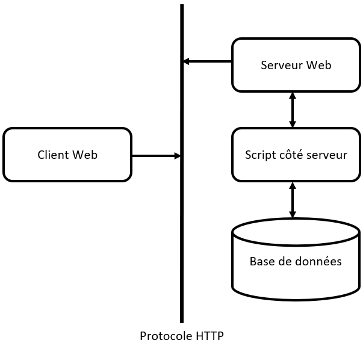

# Exploitation Web

Comment devenir une araignée en ligne

## Réseaux informatiques

La vie moderne serait très différente sans les réseaux informatiques. Ils se composent généralement de plusieurs ordinateurs (« nœuds ») qui sont connectés les uns aux autres pour partager des données et des ressources. Le réseau informatique le plus populaire est Internet, qui connecte spécifiquement les ordinateurs utilisant le protocole Internet ou « IP ».

### Comment fonctionne Internet ?

Complètement novice et avez besoin de connaître les bases ? Voici un [excellent article](https://developer.mozilla.org/fr/docs/Learn/Common_questions/Web_mechanics/How_does_the_Internet_work) qui explique l'architecture très basique d'Internet et comment les données sont transmises.

## Fondamentaux des sites web

Maintenant, les informations sur Internet sont regroupées par sites web. Ils sont constitués d'une collection de pages web et sont identifiés par un nom de domaine (comme google.com, facebook.com). Chaque page web est identifiée par son URL ou Uniform Resource Locator.

1. Qu'est-ce qu'une page web et un site web ?
  Un site web est une collection de pages web. Ainsi, un site web serait comme une maison et chaque page web serait une pièce à l'intérieur de la maison.
  
2. Décomposition d'une URL :
  [Comprendre les URL et leur structure - Apprendre le développement web | MDN](https://developer.mozilla.org/fr/docs/Learn/Common_questions/Web_mechanics/What_is_a_URL)
  
3. Interrogation :
  [Chaîne de requête — Wikipédia](https://fr.wikipedia.org/wiki/Cha%C3%AEne_de_requ%C3%AAte)
  
4. Différentes parties d'un site web et comment les modifier (HTML, CSS, JS, Backend)
  
  1. Décomposition de HTML :
    Voici un tutoriel de base sur HTML : [HTML Basic](https://www.w3schools.com/html/html_basic.asp)
    
  2. Décomposition de CSS :
    Voici un tutoriel de base sur CSS : [CSS Introduction](https://www.w3schools.com/css/css_intro.asp)
    
5. Affichage du code source :
  En cliquant avec le bouton droit de la souris sur Google Chrome ou Firefox, vous pouvez sélectionner l'option "Afficher le code source de la page" pour voir le code sur lequel le site web s'exécute sur votre ordinateur. Cela vous permet de voir le HTML et le CSS qui s'exécutent sur le site web et vous permet également de voir les scripts JavaScript en cours d'exécution sur votre ordinateur. La meilleure partie est que vous pouvez modifier directement le HTML et voir son impact sur le site web, vous permettant ainsi de le modifier selon vos souhaits. Vous pouvez également sélectionner "Inspecter l'élément" pour voir le code qui s'exécute dans une partie spécifique d'un site web.
  

Décomposition de JavaScript :

1. Pourquoi en avons-nous besoin ?
  JavaScript est utilisé car il nous permet d'ajouter de l'interactivité entre l'utilisateur et le site web. JavaScript permet à l'utilisateur d'interagir avec le site web et d'obtenir une réponse du site.
  
2. Bases - Modification des éléments HTML
  
  [JavaScript DOM HTML](https://www.w3schools.com/js/js_htmldom_html.asp)
  

## Décomposition de HTTP

1. Qu'est-ce que HTTP ?
  HTTP (Hypertext Transfer Protocol) fournit une manière standardisée aux ordinateurs de communiquer entre eux sur Internet. HTTP est un protocole de communication utilisé pour transférer des données (fichiers HTML, fichiers image, résultats de requêtes, etc.) sur Internet. HTTP dicte comment les données sont envoyées entre les clients (vous) et les serveurs.
  
2. Requêtes GET et POST [HTTP Methods GET vs POST](https://www.w3schools.com/tags/ref_httpmethods.asp)
  
3. Architecture de base
  

4. Idée de base d'un proxy
  Un serveur proxy est un ordinateur sur le web qui redirige votre activité de navigation web. Lorsque vous essayez d'accéder à un site web, votre fournisseur de services Internet (FSI) effectue la requête pour vous et transmet votre adresse IP au site web. Lorsque vous utilisez un proxy, votre requête passe par votre FSI, puis par le serveur proxy avant d'atteindre le site web que vous souhaitez visiter. Cela vous permet de masquer votre adresse IP en utilisant une autre adresse, de sorte que les sites web que vous consultez ne sachent pas qui vous êtes.

## Décomposition des bases de données

1. Ce qu'elles sont et pourquoi elles sont utiles
  Une base de données est une collection d'informations organisées de manière à pouvoir être facilement consultées, gérées et mises à jour. Les bases de données permettent de consulter rapidement les données et d'ajouter/supprimer des données instantanément. Elles sont utilisées pour stocker tous types de données.
  
2. SQL et autres
  SQL est le langage de requête structuré (Structured Query Language), un langage de programmation utilisé pour la gestion des bases de données relationnelles. Les bases de données relationnelles sont des bases de données tabulaires dans lesquelles les données sont organisées de manière à pouvoir être réorganisées et consultées de différentes manières. Les bases de données relationnelles sont faciles à étendre, et une nouvelle catégorie de données peut être ajoutée après la création initiale de la base de données sans qu'il soit nécessaire de modifier toutes les applications existantes. Les bases de données relationnelles sont composées d'un ensemble de tables contenant des données qui correspondent à des catégories prédéfinies. Chaque table possède au moins une catégorie de données dans une colonne, et chaque ligne contient une certaine instance de données pour les catégories définies dans les colonnes.
  
3. Intégration dans les sites web
  Les bases de données sont intégrées dans les sites web car elles sont le moyen le plus optimal d'afficher et de stocker des données. Les informations utilisateur telles que les mots de passe sont stockées à l'aide de bases de données. Les bases de données permettent également de modifier rapidement les données affichées sur le site web. Ainsi, si quelqu'un souhaite mettre à jour des informations sur un site web, au lieu de modifier le HTML du site web, il peut simplement modifier les données de la base de données qui sont affichées sur le site web.
  
4. Syntaxe de base de SQL
  a. SELECT : Extrait des données
  b. ORDER BY : Ordonne les résultats obtenus à partir de SELECT d'une manière spécifique. Par exemple, si vous avez une table des pays et de leurs populations, vous pouvez sélectionner les pays commençant par la lettre R, puis les trier par leur population.
  c. JOIN : Joint les données de deux tables en fonction d'une caractéristique spécifique dans la table. Par exemple, si une table contient des identifiants de clients et leurs adresses, et qu'une autre table contient des identifiants de clients et leurs achats, vous pouvez joindre les deux tables afin que les adresses des clients correspondent à leurs achats.
  d. DELETE, INSERT : Permet de supprimer des données ou d'ajouter de nouvelles données à une table.
  e. AND, OR : Permet de modifier les requêtes de manière à ce qu'elles retournent des informations en fonction de plusieurs catégories.
  f. MIN, MAX : Renvoient la valeur la plus petite ou la plus grande d'une requête.
  

## Injections

1. Comment effectuer une injection SQL de base et comment cela est possible
  L'injection SQL (SQLi) fait référence à une attaque d'injection où un attaquant peut exécuter les commandes SQL qu'il souhaite pour contrôler le serveur de base de données d'une application web. Les sites web utilisent les informations que vous leur fournissez pour interroger SQL, par exemple lors de la connexion à un site web, le site web interrogera votre nom d'utilisateur et votre mot de passe pour vérifier si vous êtes un utilisateur autorisé. Une injection SQL permettrait à l'utilisateur de fournir son propre code SQL et de l'exécuter sur le site web.
  
2. Comment se protéger contre l'injection SQL (accepter en toute sécurité les entrées utilisateur)
  a. Instructions préparées
  Les instructions préparées sont une manière de séparer le code et les entrées fournies par l'utilisateur. C'est la méthode la plus courante pour empêcher les attaquants d'essayer d'exécuter du code SQL en le fournissant en tant qu'entrée. Les instructions préparées n'exécuteront pas le code SQL et traiteront l'entrée comme une requête et non comme du code.
  
3. Comment effectuer une injection d'objet PHP
  

## Glossaire

1. 'IP' ou 'Internet Protocol' : Un ensemble de règles qui régissent la manière dont les données sont transmises sur Internet.
2. Adresse IP : Un nom unique attribué à chaque ordinateur connecté à Internet. Elle est sous la forme 'a.b.c.d', où chaque a, b, c, d est un nombre compris entre 0 et 255.
3. Paquet : En termes d'Internet, si la quantité de données à transmettre est trop importante, nous la divisons en petits morceaux appelés paquets.
4. Numéro de port : En réseau, un port est un point de terminaison de la communication et le numéro de port est le numéro spécifique associé à un port particulier.
5. Service de noms de domaine (DNS) : Une base de données qui stocke l'adresse IP de chaque site web et son nom de domaine (comme google.com).
6. Client : Ce sont généralement les ordinateurs des utilisateurs qui cherchent à accéder à des pages web ou à des moteurs de recherche. Ce sont généralement ceux qui recherchent un service particulier.
7. Serveur : Ce sont des ordinateurs qui stockent des pages web, des services ou des applications. Ce sont généralement ceux qui fournissent le service.
8. Page web : Un seul document hypertexte connecté à World Wide Web.
9. Site web : Une collection de pages web liées généralement connectées à un nom de domaine commun.
